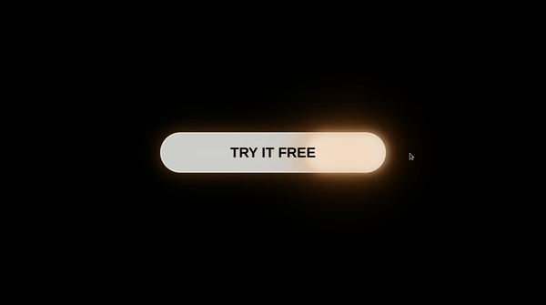

Just a cool simple button component that you can copy-paste to your React or Next.js project.

The component can be found [here](https://github.com/kais-radwan/moving-shadow-button/blob/main/src/app/components/button.tsx).

This was done as a peedrun in ~30 minutes, so make sure to make any needed changes or enhancements.